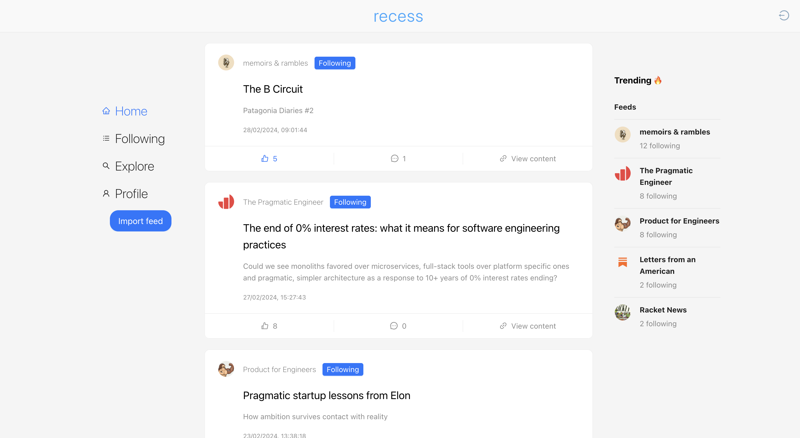

# Recess (Beta)

> 🔗 Try it live at **[app.recessfeed.com](https://app.recessfeed.com)**

> 🎉 **New:** [Add comments to your website in one minute (Alpha)](https://github.com/yakkomajuri/recess-comments-snippet/tree/main?tab=readme-ov-file#recess-comments-widget-alpha).

A content aggregator for keeping up and interacting with siloed content.

Follow, discover, and engage with personal websites, blogs, and other sources of meaningful content that are often hard to find.

**[Read our Manifesto-ish](manifesto-ish.md).**



# Run locally

> **Please note that while Recess is open source and you could deploy your own Recess, this repo was not structured in a way for simplified open source deployments (yet). As such you'd likely need to fork Recess to deploy your own version of it e.g. for internal use. I'll hopefully support this in the future.**

The backend will run on `localhost:8000` and the frontend will be accessible on `localhost:3000` by default.

## Backend

From the root directory, run:

```shell
# recommended to use pyenv or virtualenv
pip install -r requirements.txt
python manage.py migrate
python manage.py runserver
```

## Frontend

from the root directory, run:

```shell
cd frontend
yarn install
yarn start
```

